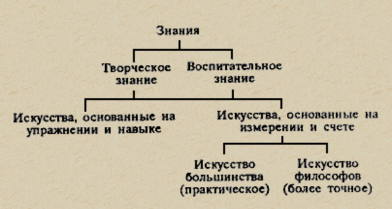

## Удовольствие или разум?

### Содержание:

- Благо - это удовольствие или разум? Или нечто третье?
- Филеб: наслаждение
- Сократ: вообще разум, но скорее гибрид разума и наслаждения с доминирующим разумом.

### Рассуждения:

как **единое переходит в множественное**:

- [Единое](/konspekty/filosofiya/antichnoe-vremya/neoplatoniki/edinoe) (предел, мера, μορφή – форма)
  - Это принцип **упорядоченности и структурирования**, который делает вещи познаваемыми.
  - Например, в музыке существуют **определённые ноты**, которые создают гармонию.
- Множественное (безмерное, беспредельное, ἄπειρον – бесконечность)
  - Это **хаотическая изменчивость, неопределённость**, которая требует упорядочивания.
  - Например, температура бывает теплее или холоднее, но без точной меры это просто поток ощущений.
- Соотношение меры и беспредельного (смешение единого и множества, σύνθεσις – синтез) ([Предел и беспредельное](/konspekty/filosofiya/antichnoe-vremya/pifagoreytsy/predel-i-bespredelnoe))
  - Всё, что существует в мире, — это смешение упорядоченности и хаоса.
  - Например, удовольствие – это изменение состояния организма, но разум придаёт ему форму и делает осмысленным.

Недостатки каждой позиции:

- Ограниченность удовольствия
  - Удовольствие изменчиво, кратковременно и субъективно.
  - Оно не может быть абсолютно добром, потому что
  - не всегда связано с истиной (существуют ложные удовольствия).
- Ограниченность познания
  - Хотя знание и #разум ближе к истине, они не приносят радости сами по себе.
  - Чистое размышление без удовольствия может быть холодным и не наполняющим жизнь смыслом.

Удовольствия бывают **истинные и ложные**

Познание позволяет **отличать истинное удовольствие от ложного**

**23e** *Сначала мы отделим от четырех три рода. Затем два из них – принимая во внимание, что каждый рассечен и разорван на множество частей, – вновь сведем к единству и попытаемся понять, каким образом оба они – и единство, и множество.*

**26a** *Разве не из этого, то есть не из смешения беспредельного и заключающего в себе предел, состоят времена года и все, что у нас есть прекрасного*

**26b** *Первый я называю беспредельным, второй – пределом, третий – сущностью, смешанной и возникающей из этих двух.*

*Потому, любезнейший, что тебя поразило изобилие этого третьего рода. Правда, и в беспредельном есть много родов, но так как они отмечены признаками увеличения и уменьшения, то беспредельное кажется единым.*

*Что же касается предела, то, с одной стороны, он не заключал множества, а с другой – мы не досадовали на то, что он не един по природе.*

**31e** *Под смешанным мы подразумеваем третий из названных выше четырех родов (как только в нас, живых существах, расстраивается гармония, так вместе с тем разлаживается природа и появляются страдания, Когда же гармония вновь налаживается и возвращается к своей природе, то следует сказать, что возникает удовольствие)*

Итого:

- **Беспредельное (бесконечное)** — наслаждение, рост, тепло и т. п.
- **Определённое (конечное)** — мера, граница, порядок.
- **Смешанное** — сочетание первых двух (например, здоровое тело, гармония).
- **Причина** — то, что соединяет и управляет (разум).

---

## Вопросы к семинару

1. Как и зачем Платон предлагает рассматривать единство единства и множества? (11b – 30d)

- Единство единого и множества — вопрос о том, как одно содержит многое и как многое сводится к единству: беспредельное множество надо разделять на определённые виды и видеть в них единый род. Это нужно, чтобы спор об удовольствии и разуме не остался словесным: и удовольствие, и разум оказываются родами с разновидностями, которые надо различать.
2. Каково отношение познания и удовольствия? (30d – 55c)

- #Удовольствие возникает, когда нарушенная гармония восстанавливается, поэтому оно изменчиво и бывает истинным и ложным. Познание нужно, чтобы отличать истинные удовольствия от ложных и придавать им меру, но разум без удовольствия холоден, поэтому лучшая жизнь смешанная, с преобладанием разума.
3. Что значит заниматься науками "по-философски", согласно Платону? (55c – 59b)

- Заниматься науками «по-философски» — значит стремиться к знанию о неизменном, истинном бытии, а не к умениям, основанным на мнении и пользе. Чистые и точные науки (арифметика, геометрия) стоят выше прикладных, а выше всех — диалектика.
4. Какова природа идеи блага? (59c – 67b)

- [Благо](/konspekty/filosofiya/antichnoe-vremya/platon/blago) не сводится ни к удовольствию, ни к разуму, а является смешением, в котором определяющее начало — мера, соразмерность, красота и истина. Разум ближе к благу, чем удовольствие, поэтому в иерархии благ на первом месте мера, затем соразмерное, потом разум, науки и искусства, и только в конце чистые удовольствия.
