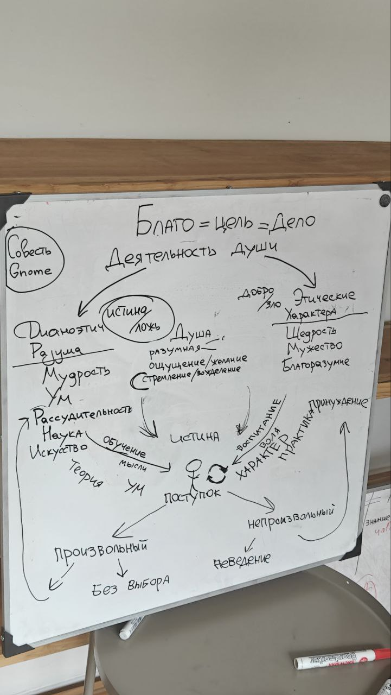

тип: #пост

тема: #античный_бали #Философия #аристотель #мысль

дата: [[Aug 6th, 2024]]

Провела вторую в жизни лекцию по философии, разбирали аристотелевскую этику.

Мне важно зафиксировать следующее:

— почему-то мне не так страшно быть в роли лектора, хотя всегда на любые темы было.

— почему-то я трачу на подготовку по 10-15 часов, хотя обычно интерес к новым хобби угасает уже через месяц-два.

— это не монетизируемо ни сейчас, ни в будущем, чистый энтузиазм (как и музыка).

Так и зачем?

Гипотез несколько:

1. Экзистенциальное бегство, карьерная фрустрация.

2. Мне реально интересно и получается.

3. Здоровые и честолюбивые меры против одиночества в неизбежные субдепрессивные фазы.

4. Всё сразу или по очереди 🤡
