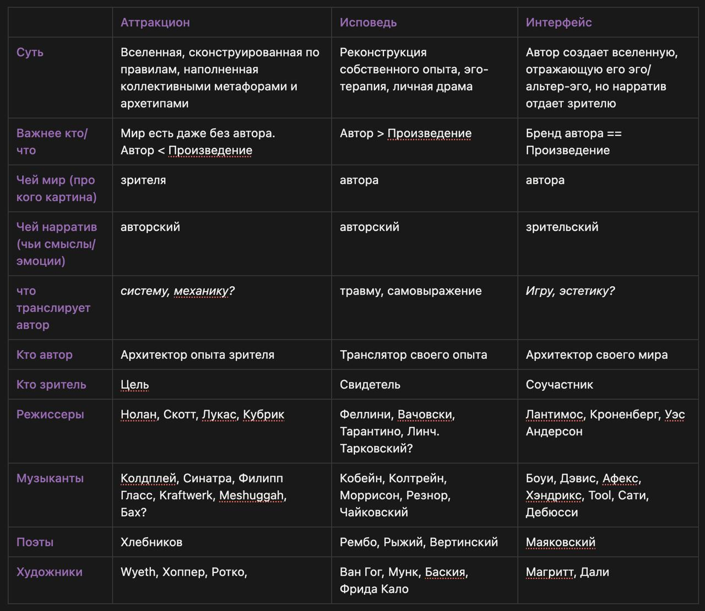

Я подумала

И рокстаров оказалось больше, чем казалось на первый взгляд, если определять рокстара как транслятора эго или альтер-эго.

Начала рассуждение с режиссеров, и в попытке понять кто из них рокстар (а я исхожу из того, что рокстар мощно транслирует своё эго) пришла к двум вопросам: о ком и для кого кино. Так условно поделила картины на мир зрителя и мир автора. Мир зрителя проектируется для него же, в личности автора нет нужды. В мир автора погружают двумя способами: или обнажая душу или демонстрируя особый почерк

Получилось три группы:

Аттракцион, деперсонализированное творчество — опыт (для) зрителя/слушателя, автор как архитектор опыта зрителя. Тут итоговый материал важнее самопозиционирования. Причем настолько, что если мы узнаем, что автор аттракциона нейросеть или анонимный коллектив продюсеров — логика и восприятие этого мира не должны сильно меняться.

Исповедь — реконструкция собственного опыта, эго-терапия, личная драма автора. Зритель как наблюдатель.

Интерфейс, в котором автор создает вселенную, отражающую его эго/альтер-эго, но нарратив отдает зрителю. Автор архитектор своего мира/бренда, а зритель — игрок или соучастник.

1. Джордж Лукас, Лантимос, Скотт.

Leftfield/ambient/rave

2. Тарантино, Вачовски,

Bowie, Reznor, Numan, Cobain.

Ван Гог, Мунк,

3. Кроненберг, Кубрик,

Davis, Coltrane,

Рембо
