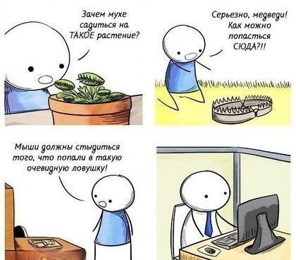

тип: #пост

тема: #daemon #Философия #внимание

дата:  [[Mar 30th, 2026]]

История про легкий философский клоунизм, а я сегодня в роли собственного разоблачителя. Выводов не будет.

С осени по начало весны я трудилась дата-инженером и, как это обычно со мной случается, работой упарывалась, пытаясь успевать за этим всем нашим эйаем. Знатно заебалась, скажем прямо. Поэтому начало 2026 года я проводила лучшим из возможных образом: слушала аудиокнижку про усталость, философию пустоты и классовую несправедливость, катаясь по необремененному такими понятиями Ломбоку.

Книжка эта за авторством Роберта Зарецки — аудиобиография Симоны Вейль. Она батрачила на заводах в 30-е, уставала явно побольше моего и выяснила, что в таком изнеможденном состоянии человек не может мыслить. Да что вы говорите. Как гибрид аристократа и рабочего, подтверждаю: айти-завод выжимает все соки и не оставляет энергии ни на мышление, ни на творчество.

Сначала некогда думать из-за постоянной работы, а потом уже и Другого рассмотреть не хочешь, незачем и нечем. Вейль предлагала давать внимание другим так, как будто тебя не существует — только так можно избежать искажения от "Я", примешивающегося во всё. Предоставив место пустоте, человек может по-настоящему встретиться с Другим, а заодно и перестать быть вещью в этом безумном консьюмеристском мире.

Вейль тотально радикальна и я далеко не со всем согласна в её философии, однако в момент прослушивания слова считывались чуть ли не как призыв. От этого ещё ироничнее то, что как только Добби стал свободен от завода, я отдохнула, воспряла духом — и... начала делать бота-ассистента, который составляет мне расписание и буквально говорит что делать. Чтобы философских отсылок не показалось мало, назвала его Daemon. Это относительно умный планировщик, адаптированный под мои интересы и привычки, его задачи – экономить мое мыслетопливо по утрам, не дать запихнуть в день слишком много "обязательного" и похвалить вечером. Ну и чтобы шутил как я, конечно, иначе зачем это всё.

Согласившись с Симоной в том, что завод это плохо, я с философской точки зрения всё сделала наоборот. Освободившись от него, сразу выстроила систему, ограничивающую меня от меня же самой. С помощью помощников построила себе помощника, чтобы и дальше проводить с ним — то есть с собой — время. Зачем теперь Другой? Вместо созерцания создала надзирателя, который решает, когда мне выйти потрогать траву.

Пустота мгновенно заполнилась новыми иллюзиями, внимание растворилось в зазеркалье цифрового одиночества — и я бегу впереди паровоза, внося вклад в его развитие своими проектами.

Вейль бы умерла еще раз (с)
